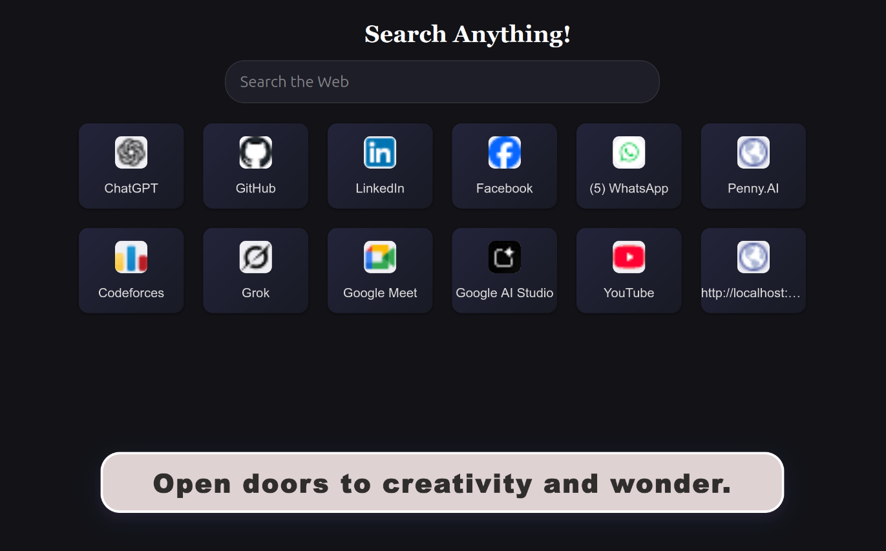
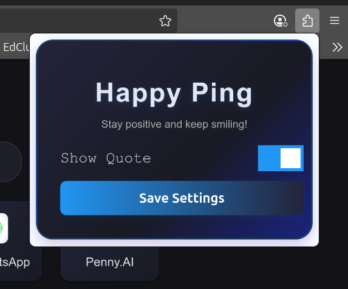
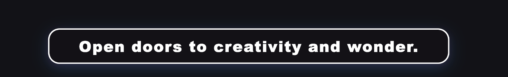
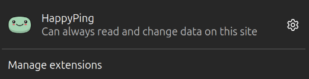

<div>
    
</div>

# HappyPing Firefox Extension

HappyPing is a motivational Firefox extension that enhances your new tab experience with cheerful quotes, a modern UI, and quick access to your favorite sites.

## Features
- Motivational quote displayed with stylish animation and glassmorphism effect
- Custom new tab page with search box and top sites
- Popup UI for quick actions
- Background script for extension logic
- Content script for tab interactions
- Notification support

## Project Structure
```
firefox/
├── manifest.json           # Extension manifest (configuration and permissions)
├── README.md               # Project documentation
├── icons/                  # Extension icons
│   └── icon48.png
│   └── icon96.png
├── scripts/                # JavaScript files
│   ├── content.js          # Content script (runs in tab context)
│   └── newtab.js           # Logic for new tab page
├── service/                # Background scripts
│   └── background.js       # Background logic (event listeners, messaging)
├── styles/                 # CSS stylesheets
│   └── newtab.css          # Styles for new tab page
├── templates/              # HTML templates
│   ├── newtab.html         # Custom new tab page
│   └── popup.html          # Popup UI
```

## UI Sample

<div style="display: flex; gap: 12px; justify-content: center; align-items: center;">
    
    
</div>
<br>
 <div style="display: flex; gap: 12px; justify-content: center; align-items: center;">
    
    
</div>

## How It Works
- **New Tab Page**: Replaces the default Firefox new tab with a custom page showing a motivational quote, search box, and top sites.
- **Motivational Quote**: Displayed with a modern animated style using CSS glassmorphism and pop-in effect.
- **Background Script**: Handles extension events, tab creation, and messaging between scripts.
- **Content Script**: Listens for messages and interacts with the tab content.
- **Popup**: Provides quick access to extension features.


## Installation & Running Locally
1. Clone this repository:
    ```bash
    git clone https://github.com/saikat709/happy-ping.git
    ```
2. Open Firefox and go to:
    ```
    about:debugging#/runtime/this-firefox
    ```
3. Click "Load Temporary Add-on" and select the `manifest.json` file from the `firefox` folder.

## Development
- Edit the files in the `firefox/` directory as needed.
- Reload the extension in Firefox after making changes.
- For styling, update `styles/newtab.css`.
- For new tab logic, update `scripts/newtab.js` and `templates/newtab.html`.

## Permissions
- `tabs`, `activeTab`, `<all_urls>`, `webRequest`, `notifications`: Required for tab management, notifications, and custom new tab functionality.

## Author
Saikat709
